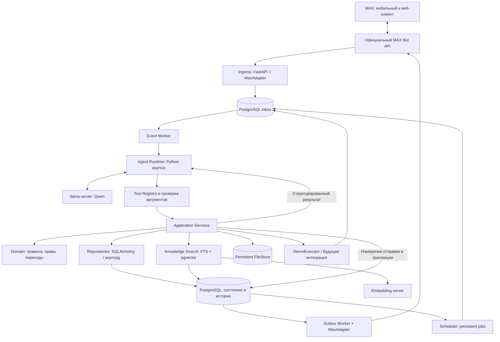
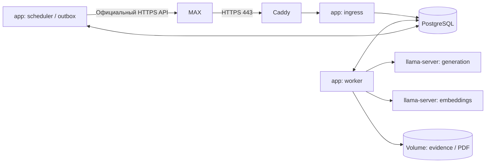

# 02. Многослойная архитектура

[Навигация](README.md) · [Стек](01-scope-and-stack.md) · [MAX](03-max-integration.md)

## 1. Компоненты



Здесь нет HTTP-вызова к собственному backend на каждом tool-шаге. Agent Runtime вызывает Application Services через `LocalToolTransport`. Возможный `HttpToolTransport` подключается к тем же schemas и handlers без изменения поведения.

## 2. Направление зависимостей

| Слой | Содержимое | Что не должен делать |
|---|---|---|
| Transport | MAX Update → внутреннее событие, webhook, callback, outbound mapping | Принимать бизнес-решения и считать голоса |
| Execution | Обработка событий, agent loop, retries, scheduler | Хранить единственную копию состояния в памяти |
| Application | Use cases: создать дело, открыть опрос, подготовить обращение | Зависеть от HTTPX/FastAPI внутри доменных правил |
| Domain | Инварианты, доступ, условия переходов, пороги | Вызывать LLM, сеть и SQL |
| Infrastructure | PostgreSQL, MAX HTTPX-клиент, inference, файлы, внешний исполнитель | Самостоятельно решать, достаточно ли оснований для обращения |

Домен определяет ports, инфраструктура их реализует; composition root связывает зависимости. Контроллеры и tools вызывают одни use cases. Не создаём отдельную бизнес-логику для ручки, команды бота и agent tool.

В Python ports — `typing.Protocol`, доменные сущности — dataclasses, внешние contracts — Pydantic models. Зависимости связываются в entrypoints; FastAPI `Depends` используется на HTTP-границе, а не внутри бизнес-сервисов. Каждый use case получает явный Unit of Work с отдельной SQLAlchemy AsyncSession. ORM-объекты преобразуются в DTO до выхода из сессии; не полагаемся на неявный lazy loading в async handlers.

## 3. Модули

| Модуль | Сервисы и ответственность |
|---|---|
| `residents` | HouseContext, Residency, подтверждение тестового проживания |
| `cases` | Дело, сообщения, evidence, авторство, история, версия |
| `audiences` | Критерий и сохранённый состав выбранных жителей |
| `polls` | Опрос проблемы, позиции и результата; детерминированный подсчёт |
| `initiatives` | Формулировка предложения, ревизии, прогресс и исполнение |
| `knowledge` | Источники, chunks, embeddings, поиск правил и ответственных |
| `requests` | Согласование, регистрация обращения, внешний статус и сроки |
| `documents` | Неизменяемый snapshot → шаблон → PDF |
| `notifications` | Доставка, карточки, напоминания, callback acknowledgements |
| `agent` | Context builder, LLM adapter, tools, run budget, журнал |
| `jobs` | Inbox, outbox, scheduled jobs, lease и dead-letter |

Для проблемы и инициативы используем общий `case` как рабочее дело, с `kind=problem|initiative`. У инициативы есть отдельные поля в `initiatives`, а документы, опрос выполнения и история используют общий `case_id`.

## 4. Исполнение и восстановление

1. Ingress проверяет происхождение webhook и сохраняет событие в inbox.
2. Worker забирает событие с lease, определяет дом/дело и выполняет детерминированный handler либо запускает агента.
3. Agent Runtime сохраняет run, контекст и tool calls; запрос к LLM идёт **вне SQL-транзакции**.
4. Каждый write-tool выполняет короткую транзакцию с проверкой версии и прав.
5. В той же транзакции сохраняются события и намерения доставки.
6. Внешняя отправка выполняется outbox worker после commit.
7. При ожидании сохраняется continuation: дело, ожидаемый тип ответа, actor/audience, срок. Run завершается.
8. Новое событие запускает новый run с актуальными данными, а не воспроизводит вслепую прежние аргументы.

Worker claims через короткий `FOR UPDATE SKIP LOCKED`, затем освобождает транзакцию и работает с lease. Нужны lease expiry и heartbeat, иначе падение процесса навсегда заблокирует событие. `SKIP LOCKED` используется для очередей, не как модель консистентности бизнес-данных. [PostgreSQL SELECT](https://www.postgresql.org/docs/17/sql-select.html).

## 5. Развёртывание



Для небольшого стенда scheduler и outbox могут быть задачами одного worker-процесса. Данные PostgreSQL и FileStore находятся на persistent volumes. Inference можно вынести на доступную машину; его endpoint защищён сетью/авторизацией. БД и tools не открываем в интернет.

Ingress запускается через Uvicorn, worker/scheduler — отдельными Python entrypoints. Lifespan создаёт HTTP clients и SQLAlchemy engines; shutdown закрывает их и завершает leases по принятой политике. Генерация PDF уходит в ограниченный process pool worker, чтобы ReportLab не блокировал цикл обработки событий. Процесс inference остаётся отдельным llama-server.

## 6. Собственный HTTP

Обязательные endpoints проекта:

- `POST /webhooks/max` — входящий Update от MAX, не метод платформы.
- `GET /health/live` — процесс жив.
- `GET /health/ready` — готовность приёма событий и критических зависимостей; отдельно показываем деградацию LLM.

Опциональный transport: `POST /tools/{toolName}` по реестру разрешённых команд. Он нужен только при отдельном процессе агента или внешнем тестовом harness. Авторизация обязательна; trusted context создаётся по авторизованному run, а не из произвольного body. Публикация API для пользователей не планируется.

## 7. Предлагаемая структура будущего кода

```text
pyproject.toml           # Зависимости, entrypoints, pytest/Ruff/mypy
uv.lock                  # Зафиксированные версии зависимостей
.python-version          # Выбранная patch-версия Python
src/dom_domych/
  entrypoints/
    api.py               # FastAPI app и lifespan; Uvicorn
    worker.py            # Async event loop и agent runs
    scheduler.py         # Jobs/outbox; можно объединить с worker
  contracts/             # Pydantic models, events, tool DTO
  domain/                # Dataclasses, policies, transitions, Protocol ports
  application/           # Use cases по бизнес-модулям, Unit of Work
  agent/                 # Runtime, context, tool registry, LlmPort
  infrastructure/
    max/                 # HTTPX adapter, MAX DTO, attachments
    postgres/            # SQLAlchemy models, repositories, jobs
    llm/                 # HTTPX llama-server adapter
    knowledge/           # Retrieval, embeddings
    files/               # FileStore
    documents/           # ReportLab / Platypus templates
    executor/            # DemoExecutor
migrations/              # Alembic revisions; единая история миграций
alembic.ini              # Конфигурация без реального пароля БД
tests/
  fixtures/              # Синтетический дом и события
  integration/
  agent_evals/
  scenarios/
deploy/                  # Compose, Caddy, примеры конфигурации
docs/engineering/        # Эта спецификация
```

Папки реализации пока не создаются. Один устанавливаемый Python-пакет содержит все слои; отдельные процессы импортируют общие contracts. Contracts и миграции имеют одного ответственного при объединении треков; остальные модули работают через согласованные интерфейсы.
