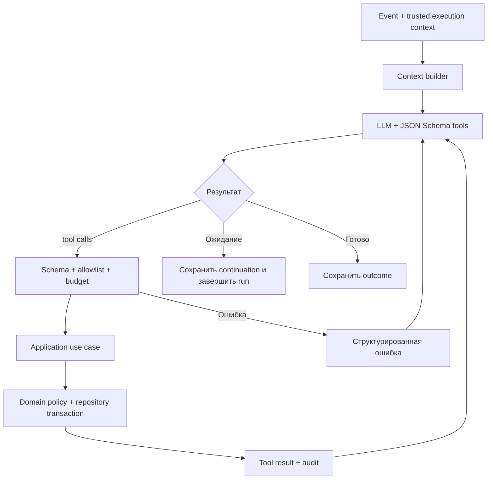
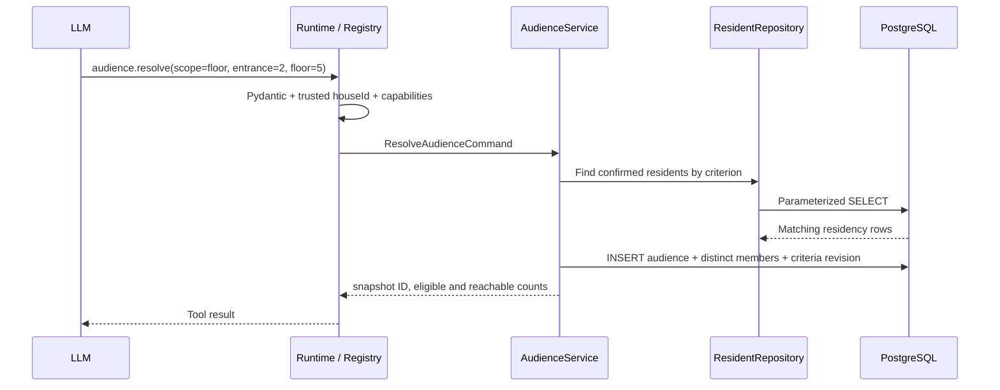

# 04. Агент, tools и проверки

> Реализация K03 в ветке `kae`: `src/dom_domych/agent/runtime.py` проверяет
> allowlist, Pydantic JSON, режим, capability и число вызовов. Аудит пока
> возвращается из run в памяти; durable run/tool-call persistence — K04.
> Подключение реальных handlers и проверка модели остаются открытыми.
> K04 добавил `ContextBuilder` и `RunStore` port с fake: при новом событии
> перечитывается версия дела и выбирается вопрос текущего actor/дома. Durable
> PostgreSQL реализация и аудит вызовов после рестарта ещё требуются.

[Навигация](README.md) · [Данные](05-data-and-state.md)

## 1. Граница ответственности

LLM понимает сообщение, ищет контекст, предлагает маршрут и выбирает tools. Она не получает SQL-доступ, токен MAX, произвольный HTTP-клиент или право устанавливать любые статусы. Tool result возвращается только после проверки и фактического выполнения операции.

Один agent runtime имеет режимы `triage`, `problem`, `initiative`, `followup`. Это ограничения контекста и доступных инструментов, а не обязательные независимые модели. Классификация — первый шаг внутри работы агента; отдельный платный вызов только ради классификации не обязателен.

## 2. Цикл исполнения



Порядок runtime:

1. Получить event и текущую версию дела; создать `agent_run`.
2. Собрать факты: сообщение, профиль с нужными полями, выбранный дом, активное дело, последние связанные события, pending question.
3. Передать разрешённые tools и правила работы с неизвестными данными.
4. Получить структурированные tool calls; сохранить request и параметры без секретов.
5. Применить validation, авторизацию, idempotency и domain guard.
6. Выполнить handler; сохранить результат, возвращённые source IDs и версию данных.
7. Передать result модели; продолжать в рамках budget.
8. Завершить с `completed`, `waiting_input`, `waiting_job`, `failed` либо `budget_exhausted`.

Независимые read-tools допускается выполнять параллельно. Мутации одного дела выполняются последовательно. После ошибки версии повторяем чтение; не повторяем запись с устаревшими аргументами.

Ответ пользователю также отправляется через tool/outbox. Текст «заявка зарегистрирована» допустим только после успешного результата регистрации; модель не может объявить успех вместо вызова.

## 3. Контракт Tool Registry

```text
ToolDefinition:
  name, description
  inputSchema, outputSchema
  allowedModes
  effect: read | write | external
  requiredCapabilities
  handler(validatedArgs, trustedContext)

TrustedContext:
  runId, eventId, houseId, caseId?
  actorId, principalType, capabilities
  correlationId, deadline, mode: demo | live

ToolResult:
  ok
  data? / error { code, retryable, details }
  entityVersion?, sourceRefs?, operationId?
```

`houseId`, полномочия и actor берутся из исполнения события. Переданный моделью объект с другим house ID отклоняется либо такое поле вообще отсутствует в schema. Background principal может выполнить запланированное действие, но не проголосовать за жителя.

Разрешён optional HTTP transport `POST /tools/{toolName}`: авторизованный run token → восстановление TrustedContext → тот же registry. Это API нашего открытого проекта, не API MAX. Основная реализация — вызов Python `async` handlers в процессе worker.

Вход/выход tools описываются Pydantic 2 models; `model_json_schema()` формирует описание для LLM, а handler повторно валидирует возвращённые аргументы. Для команд включаем запрет лишних полей и строгую проверку значимых типов. Внешние MAX DTO допускают контролируемую эволюцию схемы отдельно от строгих tool-команд. Независимые read-tools можно запускать через `asyncio.TaskGroup` с ограничением параллелизма и отдельными DB sessions; мутации одного дела остаются последовательными.

## 4. Реестр инструментов

| Tool | Аргументы модели | Handler и проверки | Результат |
|---|---|---|---|
| `house.get_context` | нужные разделы | HouseContextService; минимум данных текущего дома | Структура, ссылки на источники |
| `knowledge.search` | вопрос, scope | KnowledgeService; house/global scope, проверенные источники | Фрагменты, source ID, revision |
| `case.search` | описание, известная локация, время | SearchService; tenant filter, FTS/vector | Кандидаты с фактами, score и versions |
| `case.get` | case ID | CaseService; принадлежность дому | Состояние, evidence, pending actions |
| `case.create` | тип, факты, источник | CaseService; повторная проверка кандидатов | ID, version либо конфликт кандидата |
| `case.attach_message` | case/message ID, expectedVersion | CaseService; ownership, уникальность, версия | Привязка и новая версия |
| `conversation.ask` | вопрос, цель, допустимый получатель | ConversationService; scope, одна pending question | Question ID и delivery operation |
| `audience.resolve` | scope: дом/подъезд/этаж/стояк | AudienceService; реестр и критерии | Snapshot ID, eligible/reachable count |
| `poll.open` | case/audience ID, kind | PollService; версия политики, исключение дубля | Poll ID, deadline, rule snapshot |
| `poll.get_results` | poll ID | PollService; вычисления в коде | Счётчики, пороги, статус |
| `evidence.request` | case ID, нужные материалы | EvidenceService; определённая аудитория | Запрос и continuation |
| `case.assess_evidence` | evidence IDs, вывод, пробелы | CaseService; проверка существования источников | Assessment; не разрешение обойти остальные guards |
| `initiative.create` | предложение и область | InitiativeService; автор, версия формулировки | Case/initiative ID |
| `document.prepare` | case ID, тип документа | DocumentService; неизменяемый snapshot | Document ID, queued/ready |
| `request.prepare` | case ID, responsible ID, source refs | RequestService; маршрут и необходимые данные | Draft ID, согласование/готовность |
| `request.submit` | draft ID, expectedVersion | RequestService; policy, approval, demo/live | Operation ID; регистрация отдельным событием |
| `request.get_status` | request ID | ExecutorPort | Статус и происхождение данных |
| `schedule.check` | case ID, тип проверки | SchedulerService; срок из правила/опроса | Job ID; LLM не подставляет произвольный норматив |
| `resolution.start_check` | case ID | ResolutionService; статус исполнителя, исходная категория | Poll ID |
| `notification.send` | template/text, audience/question ID | NotificationService; recipient scope, limits | Outbox operation ID |

`poll.answer` не является tool, доступным LLM: голос сохраняет callback handler по реальному actor. Закрытие/повторное открытие по результату опроса также выполняет domain handler. Агент формирует объяснение и выбирает дальнейший маршрут там, где требуется оценка контекста.

## 5. Пример: от tool к базе



Для этажа выборка связывает `residencies → apartments`, фильтрует по дому/подъезду/этажу и активному подтверждённому проживанию. Для стояка добавляет `apartment_risers` с типом инженерной системы. Один resident присутствует в snapshot один раз, даже если имеет несколько подходящих записей.

## 6. Дедупликация: три проверки

### Retrieval

- Жёсткая изоляция по дому.
- Локация с учётом неизвестных полей: отсутствие этажа не означает любой этаж и не исключает все кандидаты.
- Поиск активных и недавно закрытых дел; повтор после устранения обычно новое дело со связью `recurrence_of`.
- FTS + embeddings, top-K фактов. Score не является вероятностью правильного объединения.
- Candidate fingerprint включает тип, объект и нормализованную локацию. При недоступности embeddings используем FTS/структурный поиск с консервативным решением.

### Смысловое решение агента

Агент сопоставляет объекты, период, симптомы, противоречия и источники. Выбирает `attach`, `create`, `clarify`. «Нет света в квартире» и «лампа на лестнице» не объединяются только из-за близкого текста. Новое сообщение может расширить область; изменение аудитории требует новой ревизии и явного пересчёта.

### Транзакционная запись

CaseService принимает `expectedVersion`. Короткая блокировка по дому/области создания + повторная проверка candidate set предотвращает очевидные параллельные дубли. Если появились новые кандидаты, возвращает `CANDIDATES_CHANGED` для повторного решения; LLM не вызывается под SQL lock. Семантическую уникальность нельзя гарантировать одним SQL UNIQUE, поэтому сохраняем источник решения и поддерживаем последующее обнаружение дублей.

Для связи сообщения используем уникальность и idempotency. Присоединение сообщения не равно автоматическому голосу: считаем только явное личное подтверждение проблемы, проверенное по actor и категории; «соседи говорят» не превращается в дополнительные подтверждения.

## 7. Документы и нормативы

Knowledge ingestion K05: оператор с `knowledge.manage` передаёт текст из
конфигурируемого списка разрешённых HTTPS-хостов как новую непроверенную
ревизию. Отдельный review открывает её для поиска. Русская FTS работает без
inference; при доступном embedding adapter записывается revision и 1024-мерный
вектор. Миграция создаёт pgvector/HNSW, если расширение установлено на сервере;
иначе остаётся FTS. Векторный поиск ограничен проверенной версией, домом,
действующим интервалом и порогом расстояния. Для нормативного действия нужен
не похожий фрагмент, а отдельная rule entry с проверенным источником, scope,
ответственным, применимостью и точкой отсчёта. На локальном PG16 проверена FTS;
pgvector-ветка и live embedding требуют отдельного стенда. Embedding endpoint
сверен с [официальным описанием llama-server](https://github.com/ggml-org/llama.cpp/blob/master/tools/server/README.md).

В run сохраняем краткое обоснование действия и source IDs, а не скрытый поток рассуждений модели. Для PDF берём утверждённый snapshot фактов; LLM может подготовить текст, но не менять число голосов, адрес, сроки или статус регистрации.

## 8. Ошибки и ограничения

`VALIDATION_ERROR`, `FORBIDDEN`, `INSUFFICIENT_CONTEXT`, `VERSION_CONFLICT`, `CANDIDATES_CHANGED`, `APPROVAL_REQUIRED`, `INVALID_STATE`, `DELIVERY_UNAVAILABLE`, `DEPENDENCY_UNAVAILABLE`.

Проверяем результаты модели и tools, включая source IDs. Сообщения жителей и найденные документы — недоверенные данные: инструкции внутри них не меняют capabilities. Нет tools для произвольного SQL, shell, URL или произвольного чтения файлов.

При недоступности LLM событие остаётся retryable, житель получает нейтральное уведомление о задержке. Для заранее подтверждённого emergency type допускается детерминированное срочное уведомление, но fallback не выдумывает диагноз, норматив или факт отправки.
