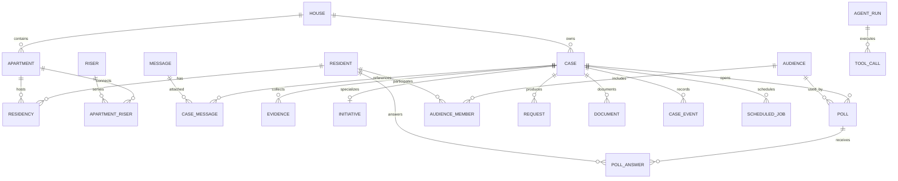
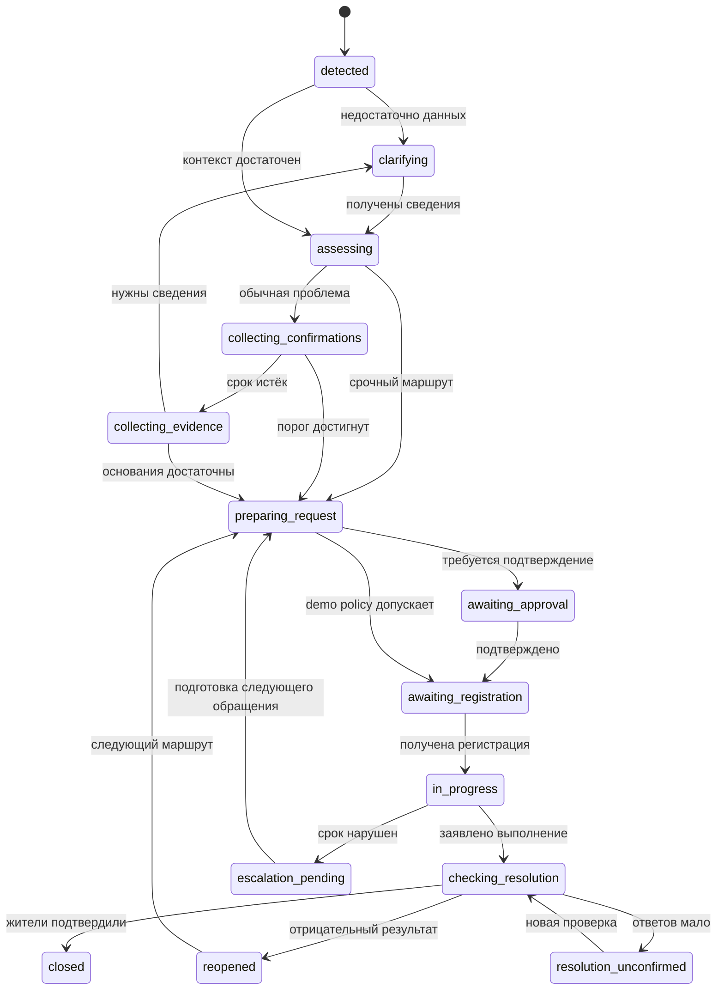

# 05. Модель данных, правила и состояния

[Навигация](README.md) · [Агент](04-agent-and-tools.md)

## 1. Основные связи



## 2. Таблицы и существенные поля

Внутренние ID — UUID; внешние MAX ID — Python `int` / PostgreSQL bigint, в LLM/tool DTO — строковое представление. Перед отправкой MAX соблюдаем числовой тип его schema; ID никогда не проходят через float. Времена — timezone-aware `datetime` / `timestamptz` в UTC, отображение через `zoneinfo` по часовому поясу дома.

Модели хранения — SQLAlchemy 2, async driver — asyncpg, миграции — Alembic. Repositories получают `AsyncSession` через Unit of Work; одна сессия не разделяется между конкурентными tasks. Pydantic DTO и доменные dataclasses отделены от ORM.

| Таблица | Основные поля / смысл |
|---|---|
| `houses` | ID, адрес, timezone, `max_chat_id`, demo flag |
| `apartments` | house ID, номер, подъезд, этаж |
| `risers`, `apartment_risers` | Тип системы и связь квартиры со стояком |
| `residents` | MAX user ID, display name, dm status |
| `residencies` | resident, apartment, role, verification status, valid interval, source=demo/manual/future_external |
| `messages` | MAX message/chat ID, actor, text revision, attachment refs, received/removed time |
| `cases` | house, kind, title, type, location, urgency, workflow status, version, recurrence_of |
| `case_messages` | case, message, relation type, source of association |
| `evidence` | case, author, message/file, description, assessment, revision |
| `audiences` | house, criteria JSON, criteria version, snapshot time, supersedes ID |
| `audience_members` | audience, resident, eligible reason, delivery state |
| `polls` | case, audience, kind, policy snapshot, opens/closes time, status, subject revision |
| `poll_answers` | poll, resident, answer, source event, answered time, revision |
| `initiatives` | case, author, wording, wording revision, decision result |
| `requests` | case, draft revision, executor, demo/live, approval, registration ID/time, external status |
| `documents` | case, template version, source snapshot hash, file key, content hash, mode |
| `knowledge_sources/chunks` | owner house/global, source URL/file, revision, reviewed state, text, vector, embedding model revision |
| `rule_versions` | rule key, applicability, duration/threshold, time origin, valid interval, reviewed source |
| `case_events` | case, event type, actor, versions before/after, fact payload, causation |
| `pending_questions` | case, actor/audience, requested fields, expiry, status |
| `agent_runs/tool_calls` | event/case, versions, model/prompt revision, tool args/result, latency, status |
| `inbox_events/outbox_messages/scheduled_jobs` | dedupe key, payload, status, attempts, lease owner/until, available time, error |

Это спецификация схемы: миграции и модели ещё предстоит написать.

### Уникальность и индексы

- `houses.max_chat_id` уникален в пространстве одного бота.
- `(poll_id, resident_id)` уникален; изменить ответ можно только пока опрос открыт, с историей ревизий.
- `(audience_id, resident_id)` уникален.
- `(case_id, message_id)` уникален; одно сообщение может содержать несколько разных проблем, поэтому глобальный UNIQUE по message ID здесь не ставим.
- `(source, source_key)` уникален в inbox.
- `(operation_type, idempotency_key)` уникален для мутаций/outbox/jobs.
- Индексы по `(house_id, status)`, нормализованной локации, времени активности; FTS и vector index по тексту.
- Composite foreign keys или явные проверки не допускают связей сущностей разных домов. Tenant filter присутствует во всех repositories, включая vector search.

## 3. Формулы и правила

### Подтверждение проблемы

Чистая реализация правил и unit tests начаты в `src/dom_domych/domain/polls/policy.py` и `tests/domain/test_poll_policy.py`. Хранение `policy_snapshot`, события и MAX-поток пока не реализованы.

`N` — число подтверждённых жителей в snapshot категории, `Y` — число уникальных явных ответов «да». Порог `p` хранится в версии политики:

```text
required_yes = ceil(N * p)
threshold_reached = N > 0 AND Y >= required_yes
```

20% в журнале — пример, не универсальная норма. Для demo policy можно выбрать 20%, явно отметить это как настройку. При N=0 агент запрашивает данные/доказательства, порог не считается достигнутым.

Повторное сообщение с явным личным подтверждением может быть нормализовано в такой же confirmation record с source message, если actor подходит категории. Повторное нажатие и последующий текст не дают второй голос.

Период ожидания — пять часов согласно журналу решений. Достигнутый порог завершает ожидание раньше; иначе по deadline запрашиваем доказательства у ответивших «да». Молчание не означает отрицательный ответ.

### Позиция по инициативе

Один подтверждённый житель — один голос; площади не участвуют. Отдельно вычисляем:

```text
participation = answered / eligible
support_total = yes / eligible
support_answered = yes / answered   # только при answered > 0
```

Конкретный denominator и условия принятия задаются policy, отображаются в карточке. Шкалу участия не подменяем шкалой поддержки. Это опрос позиции жителей; официальный кворум ОСС и соответствующие документы не выдаём за реализованную государственную процедуру.

Для начальной **demo policy `demo-initiative-v1`** выбран технический пример: участие не менее 50% подходящих жителей и поддержка не менее 60% среди ответивших. Это не утверждённая продуктовая или нормативная норма; версия и оба знаменателя сохраняются вместе с опросом. Доля «за» от всех подходящих показывается отдельно. Менять значения без новой версии политики и оценки команды нельзя.

Изменение формулировки после начала голосования создаёт новую ревизию и требует повторного подтверждения голосов, а не переносит их незаметно.

### Проверка выполнения

Точные пороги в журнале ещё не утверждены. Предлагаемый demo default для проверки: минимум 50% ответов исходной категории, не менее 80% «да» среди ответивших для закрытия; при доле «нет» более 20% среди ответивших — вернуть на дальнейшую работу. Отрицательная ветка имеет приоритет над закрытием. Это инженерная настройка демонстрации, не закон и не ранее принятое продуктовое решение.

Условия, denominator, округление и deadline фиксируются в `policy_snapshot`. При отсутствии достаточных ответов результат `unconfirmed`; закрытие автоматически не происходит. До live-пилота политика должна быть принята командой на основании тестирования.

Доменный расчёт для `demo-resolution-v1` выполняется **после финализации** опроса: сначала проверяется доля «нет» (строго более 20% ответивших), затем минимальное участие и доля «да». До финализации результат `checking`, даже если текущие ответы выглядят достаточными; событие `done` исполнителя не подменяет итог жителей. При нулевой категории или нуле ответов результат `resolution_unconfirmed`.

### Изменение аудитории

Snapshot сохраняет исходный состав для подсчёта и повторного опроса. Если выяснилось, что затронут весь стояк вместо этажа, создаём новую ревизию аудитории с явным переносом только подходящих ответов. Старый знаменатель не переписываем без истории.

Текущие права на доставку проверяем заново: вышедшим/отозванным участникам не отправляем сведения автоматически. Недоставка и отзыв права не превращаются в «нет». Если категория существенно изменилась, создаём новую проверку с новой policy snapshot.

## 4. Состояние дела и исполнителя



`requests.external_status` хранится отдельно от `cases.workflow_status` и результата опроса. Пометка исполнителя `done` не равна `closed`.

Инициатива использует ветку `proposal → voting → decision_ready|not_supported → preparing_request → ...`. При недостижении поддержки сохраняется понятный результат без выдуманного исполнения. Вся поддержанная инициатива затем использует общий контроль выполнения.

## 5. Границы транзакций

| Операция | Атомарный результат |
|---|---|
| Принять событие | inbox row и dedupe key |
| Записать ответ | answer upsert + новая версия/счётчики + threshold event при первом пересечении |
| Открыть опрос | poll + audience reference + уведомления в outbox + deadline job |
| Подготовить отправку | request operation + snapshot/approval + external job |
| Зарегистрировать | registration details + case transition + SLA jobs |
| Закрыть дело | resolution result + case event + отмена будущих активных проверок + уведомления |

Ни LLM, ни upload, ни HTTP к MAX не выполняются внутри транзакции. `expectedVersion` защищает запись после длительного inference; не держим блокировку, пока модель думает.

При ответах на границе deadline применяем одну политику: принимаем событие, надёжно полученное нашим ingress до closes_at; состояние финализируем под lock после обработки уже принятых ответов. Поздний webhook сохраняем как late, не меняя молча завершённый результат. Интерфейс сообщает фактический статус ответа.

## 6. Retry и идемпотентность

Внутренние мутации повторяем с тем же operation key. Ошибка сети внешнего API может означать неизвестный результат, а не отсутствие операции. Статусы outbox: `pending`, `leased`, `sent`, `retry`, `delivery_unknown`, `dead_letter`.

Scheduled job содержит case/request/poll ID и ожидаемую ревизию. После пробуждения сверяем текущее состояние: просрочка уже закрытого дела не создаёт жалобу. Все часы рассчитывает injected `Clock`; demo acceleration меняет виртуальное время, но не маскируется под реальное течение нормативного срока.

## 7. Секреты и история

Токены MAX, inference auth и пароли БД не попадают в таблицы prompts/tool results, логи или Git. В run сохраняем минимальный контекст; персональные поля выводятся только адресату. Сроки хранения и удаление вложений задаются отдельно; для демо используются синтетические данные. Удаление сообщения фиксируется событием, а дальнейшее хранение его содержания определяется принятой политикой, не бесконечным техническим архивом.
