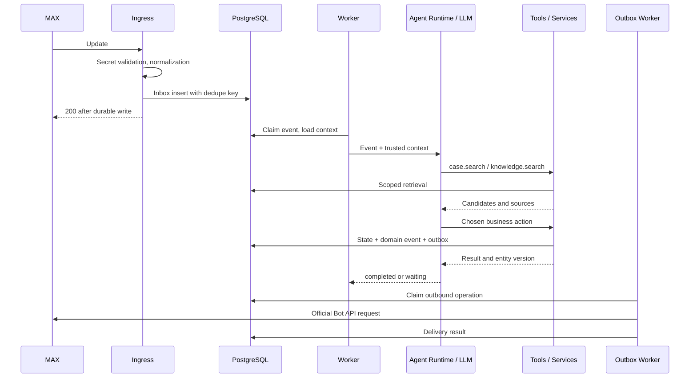
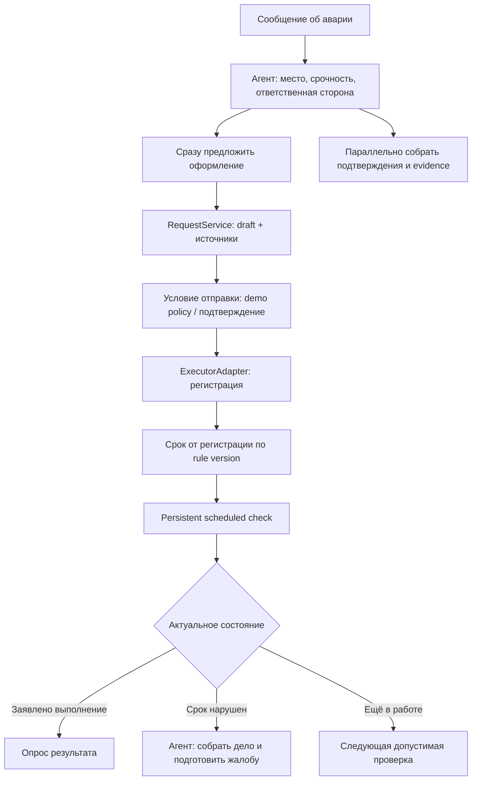
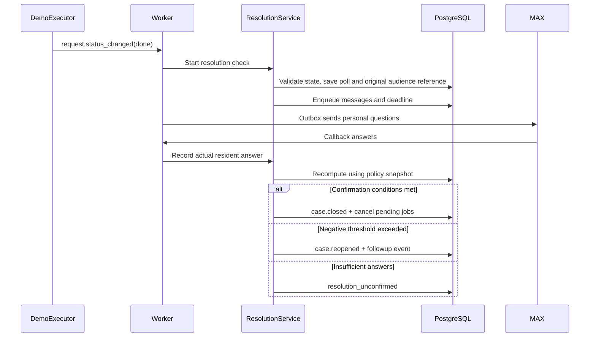

# 06. Сквозные процессы: что запускается и куда передаёт данные

[Навигация](README.md) · [MAX](03-max-integration.md) · [Tools](04-agent-and-tools.md) · [Состояния](05-data-and-state.md)

## 1. Приём любого сообщения

Обычный разговор завершается без создания дела и необязательного ответа в чат. Вопрос запускает поиск ответа по документам дома; при отсутствии основания агент уточняет или сообщает о недостатке данных. Никакие факты не берутся из выдуманной истории дома.

K message handler уже принимает `message.received` после onboarding handler:
PostgreSQL сопоставляет MAX user/chat с активным подтверждённым проживанием,
composition root задаёт resident capabilities, typed triage формирует маршруты,
а coordinator вызывает production K tools. Завершённый текст сохраняется в
общем reply outbox с ключом события. Этот путь проверен через durable inbox на
локальном PostgreSQL 18 и fake LLM; это не является live MAX-проверкой.

## 2. Обычная проблема: «На пятом этаже второго подъезда не горит свет»

| Шаг | Вызов / исполнитель | Данные и условие перехода |
|---|---|---|
| 1 | MaxAdapter → inbox | Автор, текст, message ID, house mapping |
| 2 | ContextBuilder → Agent | Профиль автора, связанный диалог, текущий pending question |
| 3 | Агент → `case.search` | Известные место/тип/время, кандидаты с evidence |
| 4 | Агент → `case.attach_message` или `case.create` | Смысловое решение; повторная проверка кандидатов и версии в сервисе |
| 5 | Агент → `knowledge.search` | Ответственный и основания маршрута; неизвестное уточняется |
| 6 | Агент → `audience.resolve` | Этаж + подъезд; snapshot подходящих подтверждённых жителей |
| 7 | Агент → `poll.open` | `kind=problem_confirmation`, policy и deadline |
| 8 | Outbox → MAX | Личные сообщения с action tokens; общая карточка без списка квартир/голосов |
| 9 | CallbackHandler → PollService | Реальный actor, проверка membership, upsert answer, подсчёт |
| 10 | Domain event → Agent | Threshold reached либо deadline expired |
| 11 | Agent → requests/documents | Подготовка обращения либо запрос доказательств |

### Когда подтверждений мало

Через пять часов scheduler создаёт событие окончания опроса. PollService финализирует текущие ответы; agent получает факт недостигнутого порога и вызывает `evidence.request` для ответивших «да». Фото сохраняется в FileStore; текст/метаданные привязываются к делу.

Без vision-модуля не утверждаем, что модель проанализировала изображение: она видит описание и факт приложения. На первом уровне достаточно запроса дополнительных сведений и проверки человеком; расширенный vision adapter добавляется отдельным этапом. Получив содержательные доказательства, агент сохраняет assessment с source IDs и продолжает подготовку обращения либо задаёт уточнение.

### Когда сообщение пришло в личку

Вход тот же, но дом определяется подтверждённой residency. При неоднозначности — выбор дома/объекта. Агент создаёт/находит дело, публикует обезличенную карточку в связанном домовом чате и запускает подтверждения категории. Личное вложение не публикуется всем автоматически.

## 3. Авария: «На пятом этаже течёт с потолка»

Аварийный маршрут не ждёт пятичасового опроса. При недостатке места агент уточняет его, одновременно сообщает о срочном следующем шаге по проверенному шаблону.

K11 `EmergencyService` проверяет доверенный emergency case, точное место и
проверенную rule entry. При известном месте немедленно вызывает K10 prepare;
отсутствие evidence не задерживает draft. Отдельный idempotent личный outbox
просит фото/уточнение, не публикуя его в общем чате. Если rule не подтверждена,
источник срочности остаётся `event:<id>`, но нормативный срок не назначается.
Это проверено с fake request и PostgreSQL outbox; MAX и общий runtime ещё нужны.

`emergency.handle` включён в K tool registry для `triage/problem`: production
composition связывает его с `PostgresRequestCases`, проверенными правилами,
`RequestService` и личным evidence outbox. На PostgreSQL 18 проверено, что при
неполной локации tool ставит только приватное уточнение и не вызывает executor.
Полная регистрация по-прежнему ждёт production Z executor.

Правило срока содержит тип нарушения, условия применимости, источник и точку отсчёта. Для каждой стадии обращения отдельный deadline; не переносим сроки из обзорного текста IDEA на все случаи. Если нет проверенного правила, не выводим выдуманный норматив.

`request.submit` создаёт operation. `request.registered` от адаптера фиксирует регистрационный номер/время и запускает сроки. Сообщение в чате и генерация PDF сами по себе не являются регистрацией.

В demo executor номера имеют тестовый префикс, а события — `source=demo_executor`. Для ускоренного показа используем DemoClock; на карточке и в материалах указано ускорение времени.

Сервис [DemoExecutorService](../../src/dom_domych/application/executor/service.py) Z11 уже задаёт типизированные команды `submit/register/set_status/get_status`. Он принимает только утверждённую ссылку на черновик из доверенного RequestService и проверяет capability для отправки, регистрации и служебного изменения статуса. [Доменная модель](../../src/dom_domych/domain/executor/models.py) сохраняет `source=demo_executor`, выдаёт номер `DEMO-*` только при регистрации и не содержит перехода workflow дела в `closed`. Fake store проверяет идемпотентность, запрет второй операции для того же request и атомарные события, но production PostgreSQL repository/outbox и связка с RequestService ещё не готовы. Поэтому тестовый номер в реальном MAX пока не появляется.

## 4. Обращение и документы

1. RequestService проверяет маршрут, обязательные факты, evidence и применимое правило.
2. Формируется immutable draft revision; DocumentService снимает snapshot с case/poll/audience versions.
3. PDF job получает snapshot, шаблон, шрифт и mode. Рендер не читает меняющиеся голоса в середине генерации.
4. ReportLab/Platypus создаёт файл в отдельной worker-задаче; FileStore сохраняет hash и метаданные. Синхронный рендер выполняется вне основного async event loop.
5. Outbox загружает файл через официальный attachment adapter и отправляет в MAX.
6. Согласование относится к конкретному hash/revision. Изменение адресата, текста или фактов инвалидирует прежнее согласование.
7. Demo policy может автоматически направить готовое обращение тестовому исполнителю после достижения порога. Для будущего live-коннектора юридически значимая отправка требует предусмотренного подтверждения жителем.

Так согласуются два пункта документации: немедленный переход после порога и проверка официального действия человеком. Отсутствие live-интеграции явно показывается, не скрывается за статусом «успешно».

## 5. Инициатива: «Давайте установим велопарковку у второго подъезда»

| Этап | Что делает агент | Что выполняет код |
|---|---|---|
| Уточнение | Выясняет место, предложение и затронутых жителей | Pending question, revision |
| Карточка | Вызывает `initiative.create` | Case kind=initiative, автор и формулировка |
| Аудитория | Выбирает scope на основании предложения | Snapshot и проверка участников |
| Голосование | Вызывает `poll.open` с kind=initiative_position | Callback, одна запись на жителя, policy |
| Напоминания | Выбирает уместный момент в рамках политики | Получатели без ответа, ограничение частоты |
| Итог | Объясняет результат и следующий шаг | Участие/поддержка вычислены сервисом |
| Документы | Запрашивает протокол позиции и реестр | PDF из snapshot; никаких выдуманных голосов |
| Исполнение | Готовит обращение и сопровождает | Общая система requests/status/jobs |
| Результат | Инициирует проверку после статуса done | Опрос исходной категории, закрытие/возврат |

При недостатке поддержки агент фиксирует итог и возможное уточнение предложения; не считает инициативу принятой. Официальная фиксация ОСС вне MVP, пакет в MAX маркируется как материалы/позиция жителей.

## 6. Проверка выполнения

Повторное открытие запускает agent run с отрицательными ответами и историей. Агент решает, какие сведения запросить и куда направить дальнейшее обращение. Он не может отменить отрицательные ответы простым выводом «скорее всего всё хорошо».

## 7. События продолжения

| Событие | Кто создаёт | Кто и как обрабатывает |
|---|---|---|
| `poll.threshold_reached` | PollService | Agent / prepare request; один event при первом пересечении |
| `poll.expired` | Scheduler | Finalize poll, затем выбор ветки |
| `evidence.added` | Attachment/message handler | Agent с новыми source refs |
| `request.registered` | Executor adapter | Установка сроков кодом |
| `request.deadline_reached` | Scheduler | Проверка актуальности, agent followup |
| `request.status_changed` | Executor adapter | Проверка доверенного источника, transition |
| `resolution.rejected` | ResolutionService | Agent выбирает следующий маршрут |
| `document.ready` | PDF worker | Attachment/outbox |
| `delivery.failed` | Outbox | Статус недоставки, ограниченный retry/другой допустимый шаг |

K composition регистрирует обработчик изменения request/document раньше agent
continuation, поэтому новый run читает уже зафиксированную версию. Тот же helper
подключает revision reader и deadline handler к общим A dispatcher/scheduler и
собирает coordinator на production K repositories. Это проверено на локальном
PostgreSQL 18 с fake LLM и fake Z ports. A process root теперь запускает этот K
контур с настраиваемым llama-server; события, требующие отсутствующих PostgreSQL
реализаций Z `ExecutorPort` и `DocumentPort`, явно завершаются ошибкой и retry.

## 8. Аварии самой системы

- Падение после inbox insert: событие подхватит worker.
- Падение во время LLM: lease истечёт, новый run перечитает дело.
- Падение после commit до отправки: outbox останется pending.
- Таймаут отправки: delivery_unknown и ограниченная сверка; не повторяем автоматически необратимое действие без проверки.
- Параллельные ответы: уникальный answer и транзакционный threshold event.
- Старый таймер после закрытия: job проверяет версию и становится no-op.
- Изменение вопроса или состава аудитории: новая revision, сохранение истории, явная актуализация карточки.

Проверки этих веток входят в приёмку, а не откладываются до расширений.
