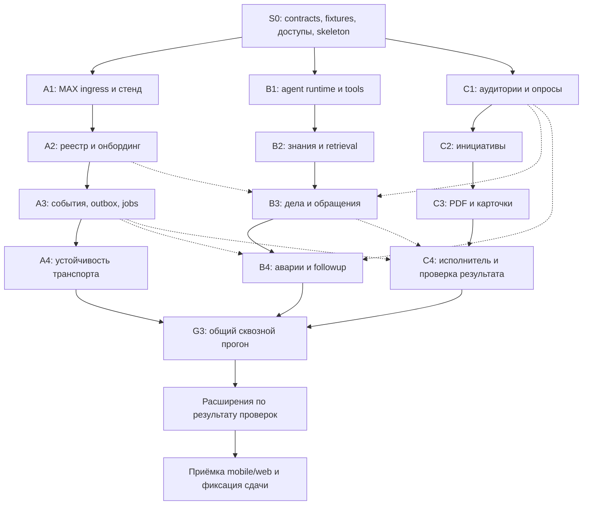

# 07. Последовательность и три параллельных трека

[Навигация](README.md) · [Приёмка](08-verification-and-release.md)

Код реализуется через AI. Три участника команды ведут треки, проверяют результат и объединяют изменения. Это не календарь и не оценка ручного набора кода: каждый пункт — законченный пакет разработки с наблюдаемым результатом.

## 1. Общая последовательность

Сплошные стрелки — порядок внутри трека. Пунктир — интеграционная зависимость. До появления соседнего модуля работаем с общим fake port, но не объявляем сценарий готовым до проверки реальной связки.

## 2. S0 — общий старт

**Результат:** одна согласованная основа, на которой три трека не создают несовместимые системы.

1. Создать uv-проект с `pyproject.toml`, `uv.lock`, `src/dom_domych`, Python 3.13; настроить Ruff, mypy, pytest и конфигурацию процессов.
2. Зафиксировать Pydantic contracts: event envelope, ToolContext/ToolResult, MAX delivery DTO; Protocol ports для repositories, Clock, ExecutorPort, FileStore и Unit of Work.
3. Утвердить имена событий/статусов и границы модулей по [04](04-agent-and-tools.md) и [05](05-data-and-state.md).
4. Подготовить синтетический дом: несколько этажей, подъездов и стояков; несколько жителей в одной квартире; недоступная личка; неподтверждённый участник.
5. Подготовить fixtures: обычная проблема, авария, инициатива, повтор, неизвестное место, отрицательное выполнение.
6. Зарегистрировать/получить разрешённого бота, заранее выбрать ник, проверить токен. Настроить тестовый чат и участников.
7. Запустить выбранную модель и проверить tool calling, русский язык и задержку. Зафиксировать revision и ограничения.
8. Проверить лицензии прямых зависимостей; выбрать patch-версии и сохранить `uv.lock` / `.python-version`. Проверить установку через `uv sync --locked`.

**Выходная проверка:** contracts проходят mypy и Pydantic validation, fixture проходит через fake handler, MAX smoke-test и LLM probe имеют зафиксированные результаты. Если доступ к MAX или inference задерживается, разработка модулей продолжается на fixtures, но G1 не считается пройденным до реальных probes.

## 3. Трек A — платформа, MAX и надёжность

**Владелец:** участник 1. Основные области: `src/dom_domych/entrypoints`, infrastructure/max, postgres runtime, deploy, residents. Участник выступает интегратором Alembic-миграций.

### A1. Приём событий и запуск стенда

- FastAPI webhook под Uvicorn, проверка secret, Pydantic normalization и durable inbox.
- HTTPX MaxApiClient: проверить URL, TLS, timeouts, `GET /me`, обычный ответ, callback, загрузку PDF-fixture.
- Compose и Caddy; health/readiness, конфигурация вне Git.
- Dev polling как отдельный режим; один consumer на токен.

**Готово:** реальное сообщение из MAX сохраняется в PostgreSQL и получает ответ; повторный webhook не создаёт второй event. Webhook не ждёт LLM.

### A2. Реестр, квартира и личный диалог

- House/resident/residency repositories на SQLAlchemy async, Unit of Work и Alembic-миграции.
- Онбординг в личке, привязка тестового пользователя к квартире.
- Подъезд, этаж и связи инженерных стояков; раздельная проверка проживания и доступности лички.
- HouseContextPort и выборки жителей для C1/B3.

**Готово:** запрос по этажу/стояку возвращает правильных уникальных жителей, разные дома изолированы. Тестовые участники могут получить личное сообщение.

### A3. Доставка, callbacks и время

- Inbox leases, outbox, scheduled jobs и Clock; отдельные Python entrypoints, не FastAPI BackgroundTasks.
- Rate limiting, backoff, attachment-not-ready, message IDs и обновление карточек.
- Action tokens, callback identity, транспорт к PollService; карточки принимаются через renderer interface C3.
- Events от scheduler/executor проходят тот же dispatcher.

**Готово:** сохранённый job срабатывает после перезапуска, callback не записывает повторный голос, отправка возвращает operation status.

### A4. Устойчивость и развёртывание итоговой версии

- Failure/retry/dead-letter; delivery_unknown; coalescing обновлений карточек.
- Смена прав бота и stopped DM; безопасная остановка worker и восстановление leases.
- Секреты в логах, состояние volumes, backup/restore тестовых данных.
- Объединение треков на общем стенде и матрица mobile/web.

**Готово:** транспортные failure tests из [08](08-verification-and-release.md) проходят; установленная версия соответствует конкретному commit.

## 4. Трек B — агент, знания, проблемы и аварии

**Владелец:** участник 2. Области: `src/dom_domych/agent`, cases, requests, knowledge, rule engine; contracts tools согласовывает с соседями.

### B1. Agent Runtime и реестр tools

- LlmPort на HTTPX, JSON Schema из Pydantic tools, LocalToolTransport и Python async handlers.
- Цикл вызовов, validation, trusted context, budgets, run/tool audit.
- Pending questions и возобновление по событию; fake tools для первоначальных evals.
- Режимы triage/problem/initiative/followup.

**Готово:** агент выбирает инструмент, получает result, делает следующий шаг; неверный tool/аргумент/чужой дом блокируется. Отсутствующий вызов не превращается в сообщение об успехе.

### B2. Знания, классификация и поиск кандидатов

- Ingestion проверяемых источников, source revisions, embeddings/FTS.
- Пять категорий сообщений, уточнения, поиск ответственного и правила.
- Semantic/structured retrieval с изоляцией дома и fallback без embeddings.
- Evals на совпадения и противоречивые сообщения.

**Готово:** агент показывает source refs, не выдумывает нормативы, отличает повтор от новой проблемы после устранения. Интеграция с реестром A2 проверяется на G1.

### B3. Полный процесс обычной проблемы

**Зависимости для интеграции:** A2, C1; транспортные stubs заменяются A3 по готовности.

- CaseService, attach/create, version checks, защита от параллельных дублей.
- Аудитория → опрос → порог/истечение → evidence → request draft.
- Индивидуальный вход через личку и вопрос об объекте.
- RequestService, demo/live policy, approval на конкретную revision, ExecutorPort.
- Подключение tools к реальным use cases вместо fake handlers.

**Готово:** несколько разных сообщений образуют одно дело, подсчёт корректен, недостаток подтверждений запускает запрос доказательств, формируется draft для C3/C4.

### B4. Аварии и самостоятельное продолжение

**Зависимости:** A3, C1, затем C4 для полной проверки.

- Аварийная ветка без ожидания коллективного порога.
- Проверенные правила, регистрационное событие, SLA jobs.
- Контроль статуса, просрочка, подготовка жалобы с evidence.
- Отрицательный результат выполнения → followup agent run.
- Agent evals на нескольких формулировках, а не только фразах демо.

**Готово:** агент возобновляется по сроку и изменению статуса, объясняет следующий шаг, не запускает сроки до регистрации и не эскалирует закрытое дело.

## 5. Трек C — опросы, инициативы, документы, результат

**Владелец:** участник 3. Области: audiences, polls, initiatives, documents, resolution, demo executor. Использует MAX port трека A.

### C1. Аудитории и опросы

- Snapshot criteria/members, dedupe жителей, eligibility и delivery отдельно.
- PollService, уникальные ответы, правила/округление, threshold events.
- Опрос подтверждения проблемы, позиции и выполнения с разными policy.
- Командный интерфейс callback handler; tests на fixture repository до A2.

**Готово:** повторные ответы не увеличивают счёт, отсутствие ответа не считается «нет», пороги и знаменатели объяснимы.

### C2. Инициативы

- InitiativeService, формулировки и ревизии, карточка-представление.
- Шкалы участия и поддержки, закрытие опроса, адресные напоминания.
- Один житель — один голос; изменение предложения не переносит голоса молча.
- Tools для B1 через общие contracts.

**Готово:** произвольная инициатива проходит путь до принятой/неподдержанной позиции; голосование не зависит от заранее зашитой фразы.

### C3. Документы и представление в MAX

- PDF обращения, протокола позиции, реестра уведомлений и черновика жалобы на открытом ReportLab/Platypus.
- Snapshot/hash/template revision, кириллица, длинные таблицы, многостраничность; рендер в ограниченном process pool worker.
- Renderer карточек: проблема, инициатива, статус, результат и пометки demo.
- Передача файлов и renderer output через A3; factual inputs из B3.

**Готово:** данные в PDF совпадают с snapshot; документы открываются на мобильном и веб-клиенте; заготовки официальных документов не представлены как совершённое действие.

### C4. DemoExecutor и проверка выполнения

**Зависимости:** B3 RequestService, A3 jobs/outbox.

- Тестовая регистрация и статусы исполнителя по ExecutorPort.
- Служебное действие в боте для разрешённого demo operator; житель не может выдать себя за исполнителя.
- ResolutionService: исходная категория, повторный опрос, closed/reopened/unconfirmed.
- Документы и история отражают итог; события для B4 followup.

**Готово:** статус «выполнено» вызывает опрос, отрицательные ответы возвращают дело в работу. Инициатива использует тот же цикл исполнения.

## 6. Общие контрольные точки

| Gate | Нужные части | Что команда проверяет вместе |
|---|---|---|
| G0 | S0 | Реальный доступ к MAX и inference, contracts и fixtures согласованы |
| G1 | A2 + B2 + C1 | Реальные MAX-события, разбор и retrieval; реестр → правильная аудитория → опрос через handlers. Полная агентная связка проверяется на G2 |
| G2 | A3 + B3 + C3 (включая C2) | Обычная проблема и инициатива → подтверждения/голоса → PDF в MAX |
| G3 | A4 + B4 + C4 | Авария/инициатива/проблема → исполнение → повторный опрос → закрытие или возврат |
| Release | G3 + выбранные расширения | Полная матрица mobile/web, сбои, лицензии, секреты, demo labels, fixed commit |

Gates проходят по мере готовности; общий стенд обновляется после каждого совместимого объединения, а не только на G3.

## 7. Как делить параллельную AI-разработку

- Один task/worktree на независимый пакет, ветки вида `codex/max-transport`, `codex/agent-runtime`, `codex/polls-documents`.
- В запросе на реализацию указывать task ID, документы, owned paths, входные contracts, выходной результат и критерии готовности.
- Изменение shared contract сначала согласовывается в коротком общем изменении. Не поддерживаем три несовместимые версии Event или Case.
- Каждый трек пишет Alembic revisions своего модуля, интегратор A согласует `down_revision` и объединяет ветвление в одну принятую историю; уже объединённые миграции не переписываются.
- Перекрёстные участки проверяет соседний трек: A проверяет transport, B — поведение агента, C — смысл пользовательского результата и документы.
- Внешние доступы и продуктовые решения остаются задачами команды; AI пишет реализацию, тесты и инструкции и устраняет обнаруженные ошибки.

## 8. Расширения после G3

Это очередь расширения, а не запрет начинать независимую подготовку раньше. В финальный стенд включаем только проверенные модули.

| Очередь | Пакет | Зависимости | Критерий включения |
|---|---|---|---|
| E1 | Память дома и ответы по прошлым решениям | B2 + история G3 | Ответ содержит источник, не смешивает дома и старые/актуальные сведения |
| E2 | Анализ фотографий | C3 FileStore + evidence B3 + отдельная открытая vision model | Проверки на нерелевантные/неясные фото; вывод не подменяет факт |
| E3 | Голосовые жалобы | MAX audio + отдельный разрешённый ASR | Текст распознан, пользователь может исправить адрес/место |
| E4 | Повторяемость, сводки и адресные напоминания | История, jobs, E1 | Объяснимая связь случаев, лимиты уведомлений |
| E5 | Ранние признаки общей проблемы | E4 + eval dataset | Нет автоматической отправки обвинений по слабым сигналам; агент уточняет |

Для E2/E3 конкретные модели выбираются отдельным решением с проверкой лицензий и ресурсов. Текстовая baseline не получает эти способности автоматически.

При высоком темпе берём больше пакетов; при проблемах интеграции сначала исправляем полный цикл. Количество сгенерированных файлов не является метрикой готовности.
